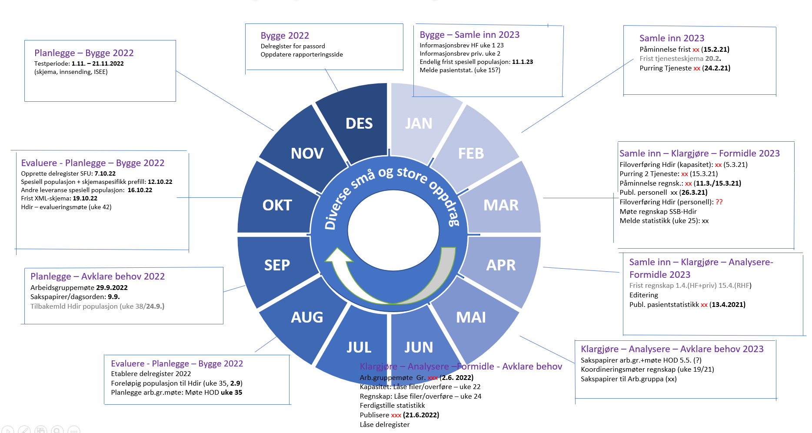

# Spesialisthelsetjenesten

Her finnes programmer som brukes i produksjonssløp for statistikkene som inngår i [Spesialisthelsetjenesten](https://www.ssb.no/helse/helsetjenester/statistikk/spesialisthelsetjenesten). 

Spesialisthelsetjensten er inndelt i følgende statistikkområder:
+ [Regnskap](https://github.com/statisticsnorway/spesh-regnskap)
+ [Personell](https://github.com/statisticsnorway/spesh-personell)
+ [Aktivitet og tjenester](https://github.com/statisticsnorway/spesh-aktivitet)

I tillegg ligger programmer relatert til Geostat-prosjektet (geografiske analyser) her:
+ [Geostat - Work Package 2: Population and Health](https://github.com/statisticsnorway/geostat-wp2)

## Årshjul

I dette repoet ligger hovedsakelig programmer som er felles for alle produksjonsløpene i statistikkområdene. Disse oppgavene er følgende:
+ [Dropplister](https://github.com/statisticsnorway/speshelse/blob/master/experimental/Droplister%20forenkling.ipynb)

## KLASS

Før noen av produksjonsløpene kan kjøres må alle kodelistene som omfatter spesialisthelsetjenesten være oppdatert for statistikkåret. 

+ [Standard for offentlige helseforetak](https://www.ssb.no/klass/klassifikasjoner/603)
+ [Standard for private helseinstitusjoner med oppdrags- og bestillerdokument](https://www.ssb.no/klass/klassifikasjoner/604)
+ [Standard for regionale og felleseide støtteforetak i spesialisthelsetjenesten](https://www.ssb.no/klass/klassifikasjoner/605)
+ [Kodeliste for tjenesteområder i spesialisthelsetjenesten](https://www.ssb.no/klass/klassifikasjoner/610/versjon/1768/koder)
+ [Kodeliste for funksjonskontoinndeling til helseforetakenes regnskapsdata](https://www.ssb.no/klass/klassifikasjoner/602/versjon/1757/koder)
+ [Kodeliste for artskontoinndeling til helseforetakenes regnskapsdata](https://www.ssb.no/klass/klassifikasjoner/606)
+ [Kodeliste for døgnplasser og sengedøgn](https://www.ssb.no/klass/klassifikasjoner/612/koder)
+ [Korrespondanse mellom 612 og 610](https://www.ssb.no/klass/klassifikasjoner/612/korrespondanser/893)
+ [Kodeliste for fødeavdelinger](https://www.ssb.no/klass/klassifikasjoner/608)
+ [Kodeliste for fødestuer](https://www.ssb.no/klass/klassifikasjoner/609)

## Opptaksområder

